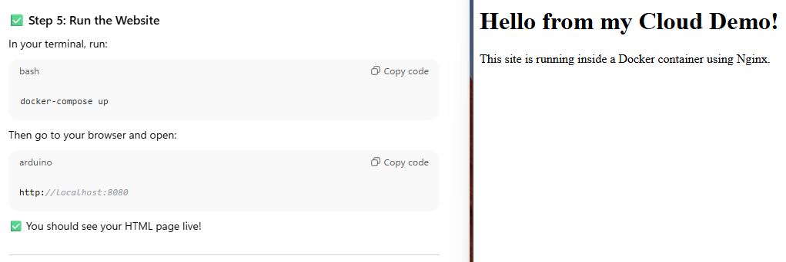

# Junior Cloud Engineer Showcase Project

## 🔧 What It Does
- Hosts a simple website using Docker + Nginx
- Automates deployment with GitHub Actions
- Simulates a cloud environment locally

## 🧪 How to Run It
1. Install Docker

2. Clone this repo:
git clone https://github.com/your-username/cloud-demo-project.git
cd cloud-demo-project

3. Run the site:
docker-compose up

4. Visit `http://localhost:8080` in your browser

## 💡 Why This Project?
This project shows I understand the basics of cloud-like deployment, containerization, and CI/CD, even without paid services.

## 📸 Screenshot

